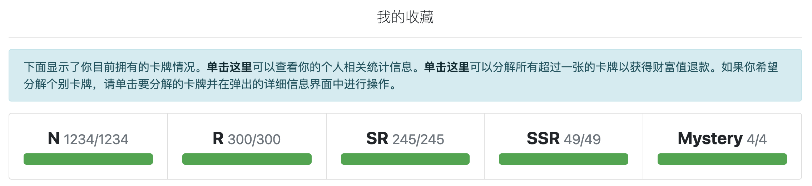

# cc98-drawcard
需要在**浙江大学内网**环境下使用。



## draw_card_v2

使用`Selenium`获取抽卡中心的cookies，需要确保 chromedriver 在系统环境变量中。


## draw_card_v3

用`Requests`完成全部登录、授权。


## draw_card_v3.1(推荐使用)

在v3基础上增加「抽卡情况总览」和「自动分解重复卡牌」，需要pip安装`prettytable`。


## 查看抽到的SSR和M卡

可以添加下面的代码来查看抽到的`SSR`和`M`卡，需要pip安装`scikit-image`。

```python
from skimage import io

SSR_M = SSR_cards + M_cards
if SSR_M:
    for i in SSR_M:
        img_src = i.find_all('img')[1]['src']
        image = io.imread('https://card.cc98.org'+img_src)
        io.imshow(image)
        io.show()
```

